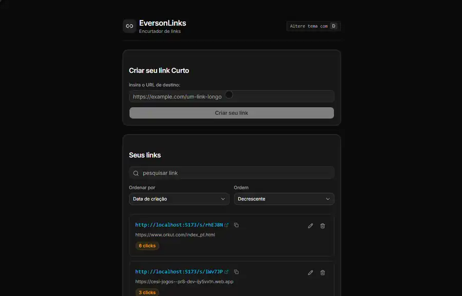

# 🌐 EversonLinks

> **Gerenciador e encurtador de links autohospedado, privacidade de dados e controle total de métricas.**



---

### 📖 A Origem do Projeto: A História de Everson

_Esta é a história que inspirou a criação e o nome do projeto (e que, embora seja a verdadeira motivação, não pôde ser incluída no paper acadêmico original):_

> Everson é um escritor apaixonado por compartilhar conhecimento em seu blog pessoal. Com o crescimento de seus leitores, ele sentiu a necessidade frequente de compartilhar links externos de referência. No entanto, as URLs longas eram visualmente desagradáveis, difíceis de ler e prejudicavam a usabilidade do blog.
>
> Ao buscar soluções de encurtamento de links no mercado, Everson deparou-se com ótimas plataformas, mas com limitações severas em seus planos gratuitos — como expiração automática de links, restrições na personalização e falta de relatórios de tráfego. Como ele mantinha o blog sem investimentos financeiros ou patrocínios, pagar por assinaturas caras estava fora de cogitação.
>
> Everson precisava de algo simples, robusto e que atendesse perfeitamente a três necessidades básicas:
>
> 1. **Encurtar URLs** de maneira rápida e personalizada.
> 2. **Rastrear acessos** (saber quantas pessoas clicaram ou quantas vezes o link foi acessado).
> 3. **Controle absoluto (Self-Hosted)**: reter a gestão integral sobre seus próprios dados, com liberdade total para criar, alterar, excluir e monitorar links quando e como quisesse, sem depender de intermediários.
>
> Assim nasceu o **EversonLinks**, um projeto construído para resolver o problema de Everson e servir como um utilitário prático e eficiente de uso pessoal.

---

### 🎓 Contexto Acadêmico

O **EversonLinks** foi o objeto de estudo e desenvolvimento do artigo acadêmico:
**"Desenvolvimento de uma Aplicação Web para Gestão e Encurtamento de Links sob a Ótica da Arquitetura Monorepo"**

- 📄 **[Leia o Artigo Acadêmico Completo (PDF)](docs/paper.pdf)**
- **Acadêmico:** Pedro Ryan Aranha da Costa
- **Turma:** FLD6786572CET
- **Tutor:** Cristiano Flores dos Santos
- **Ano:** 2026

O objetivo geral do trabalho foi apresentar o desenvolvimento e a implementação de uma aplicação web de uso pessoal (_single-tenant_), demonstrando como stacks tecnológicas modernas podem ser combinadas para prover uma solução independente, escalável e de altíssimo desempenho, com latência mínima em redirecionamentos HTTP.

---

### ⚡ Arquitetura e Decisões de Design (Baseado no Artigo)

#### 1. Arquitetura Monorepo

O projeto foi estruturado utilizando o padrão de repositório único (**Monorepo**), o que permite centralizar pacotes de front-end, back-end e configurações de banco de dados em um único espaço de trabalho (utilizando `workspaces` e gerenciado via `Turbo`), facilitando o compartilhamento de tipos, configurações e dependências.

#### 2. Tecnologias Utilizadas

- **Ambiente de Execução (Runtime):** [Bun](https://bun.sh) — escolhido pela sua altíssima velocidade e suporte nativo ao TypeScript.
- **Back-end:** [ElysiaJS](https://elysiajs.com/) — framework web minimalista e ergonomicamente planejado para alto desempenho, com validação de dados rápida usando esquemas tipados via TypeBox.
- **Persistência:** [SQLite](https://sqlite.org) (banco relacional ágil) + [Prisma ORM](https://www.prisma.io) (como camada de abstração que protege a aplicação contra acoplamento ao SGBD e facilita migrações futuras, como para o PostgreSQL).
- **Front-end:** [React](https://react.dev) + [Vite](https://vitejs.dev) — criando uma Single Page Application (SPA) reativa e de rápida renderização.
- **Gerenciamento de Estado:** [TanStack Query](https://tanstack.com/query) (React Query) — para separação robusta de estado do cliente e do servidor (caching, sincronização e tratativas de loading/erro assíncronas).
- **Estilização:** [Tailwind CSS](https://tailwindcss.com) + [Shadcn UI](https://ui.shadcn.com) — componentes minimalistas sob uma proposta visual _Developer-First_ (tema escuro nativo, alta legibilidade e foco na experiência de uso limpa).

---

### 📐 Principais Pilares Técnicos do Paper

- **Redirecionamento HTTP 302 (Found) vs. 301 (Moved Permanently):**
  Uma das decisões cruciais do projeto foi a utilização expressa do status **HTTP 302**. Se o redirecionamento fosse permanente (HTTP 301), os navegadores dos usuários salvariam o destino em cache local. Os acessos subsequentes seriam direcionados pelo navegador sem passar pelo servidor de EversonLinks, inviabilizando o rastreamento real das métricas de cliques. O uso de **HTTP 302** garante que toda requisição alcance a API, registrando o clique no banco antes de fazer o redirecionamento.
- **Proxy Reverso no Vite (Ambiente de Desenvolvimento):**
  Para solucionar restrições de segurança do navegador relacionadas ao CORS (Cross-Origin Resource Sharing) em desenvolvimento, a aplicação usa a configuração de proxy do servidor Vite, garantindo que as requisições para a API e o redirecionamento de links (via rotas `/s/`) coexistam sob o mesmo domínio de forma transparente.
- **Separação de Preocupações (Separation of Concerns):**
  Toda a lógica de negócios e regras para persistência dos links está desacoplada dos controladores de rotas, isolada em uma camada dedicada de serviços (`LinksService`), tornando o código limpo, testável e altamente reutilizável.

---

### 🗄️ Modelagem de Dados (Prisma Schema)

O esquema relacional é intencionalmente enxuto e focado no essencial:

```prisma
model Link {
  id          String   @id @default(cuid())
  originalUrl String
  shortCode   String   @unique
  clicks      Int      @default(0)
  createdAt   DateTime @default(now())
}
```

- `originalUrl`: O endereço de destino do link longo.
- `shortCode`: Código alfanumérico curto gerado aleatoriamente (usando a biblioteca `nanoid(6)`).
- `clicks`: Contador de visitas acumuladas.
- `createdAt`: Timestamp de criação para ordenação cronológica.

---

### 🛣️ Endpoints da API

A API RESTful é exposta pelo servidor ElysiaJS e possui as seguintes rotas:

#### Rotas de Gerenciamento (`/api/links`)

- **`POST /api/links`**
  - **Descrição:** Registra uma nova URL e gera seu respectivo código curto de 6 caracteres.
  - **Body (JSON):** `{ "originalUrl": "https://exemplo.com" }`
  - **Retorno (201 Created):** Retorna o objeto do link criado.

- **`GET /api/links`**
  - **Descrição:** Lista todos os links cadastrados (com ordenação e suporte a busca).
  - **Query Params (opcional):** `?search=termo`
  - **Retorno (200 OK):** Array de objetos contendo os links e seus contadores de cliques.

- **`PATCH /api/links/:id`**
  - **Descrição:** Edita a URL original de um link existente.
  - **Body (JSON):** `{ "originalUrl": "https://nova-url.com" }`
  - **Retorno (200 OK):** Objeto do link atualizado.

- **`DELETE /api/links/:id`**
  - **Descrição:** Remove permanentemente um link encurtado.
  - **Retorno (204 No Content).**

#### Rota Pública de Redirecionamento

- **`GET /s/:shortCode`**
  - **Descrição:** Intercepta o acesso ao link curto. Realiza o incremento no contador de cliques no banco de dados e redireciona com status **HTTP 302** (Found) para a URL original.
  - **Retorno (302 Found / 404 Not Found).**

---

### 📦 Estrutura do Repositório

```text
EversonLinks/
├── apps/
│   ├── server/   # Back-end em ElysiaJS & Bun
│   └── web/      # Front-end React + Vite + Tailwind + Shadcn UI
└── packages/
    ├── db/       # Configuração e migrações do Prisma ORM + SQLite
    └── ui/       # Componentes de interface compartilhados (Shadcn UI)
```

---

### 🚀 Como Executar o Projeto Localmente

#### Pré-requisitos

- Ter o runtime [Bun](https://bun.sh) instalado.

#### Passos para Configuração

1. **Clonar o Repositório:**

   ```bash
   git clone https://github.com/pedro-ryan/EversonLinks.git
   cd EversonLinks
   ```

2. **Instalar Dependências:**
   Instale todas as dependências do monorepo a partir da raiz:

   ```bash
   bun install
   ```

3. **Configurar as Migrações do Banco de Dados:**
   Gere o client do Prisma e execute a migração inicial do SQLite:

   ```bash
   bun --filter @repo/db generate
   bun --filter @repo/db migrate:dev
   ```

4. **Executar em Desenvolvimento:**
   Inicie o servidor e o front-end simultaneamente em modo de desenvolvimento com o Turbo:

   ```bash
   bun dev
   ```
   - A aplicação web estará disponível por padrão em `http://localhost:5173`.

5. **Gerar Versão de Produção (Build):**
   ```bash
   bun run build
   ```

---

### 📄 Considerações Finais

Este projeto foi desenvolvido como parte de um trabalho acadêmico de tecnologia aplicada.
